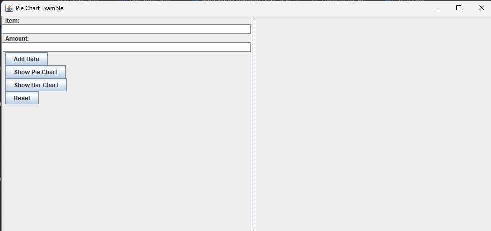
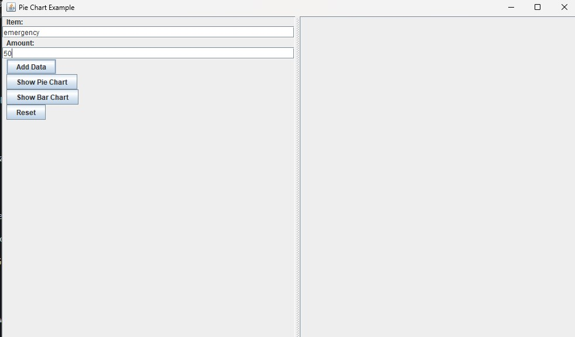
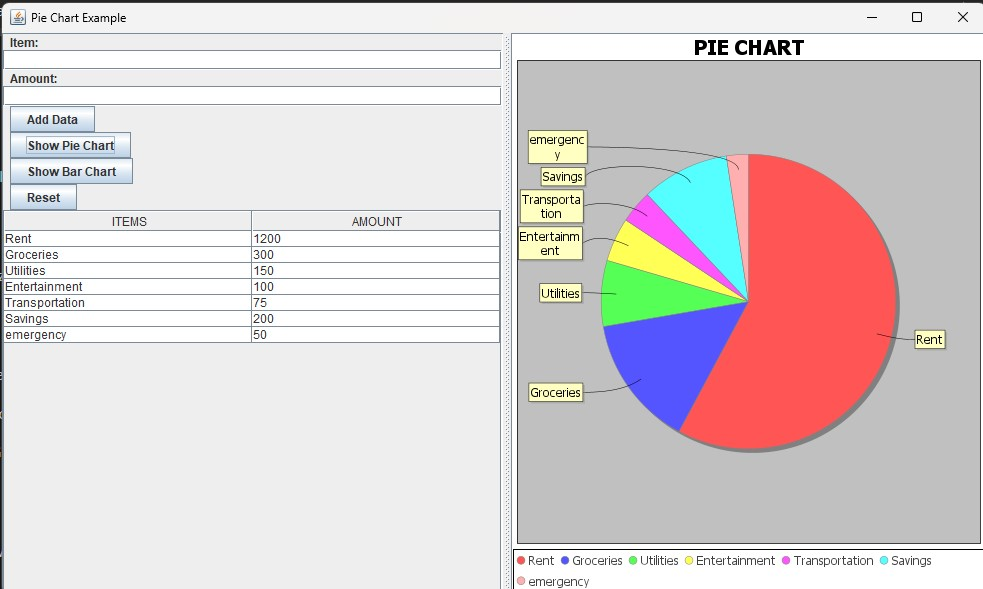
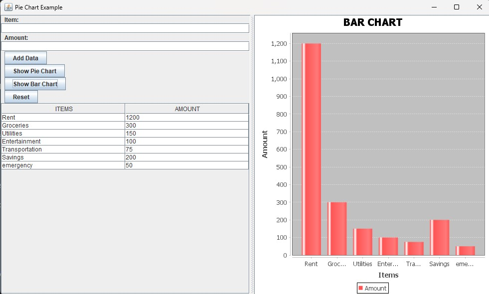

# DataVisualization_Using_Java
 To implement the tables that contain the item names & amount & using that information generate a pie chart and Bar Graph from the class JfreeChart.

This project demonstrates data visualization techniques using Java. It includes functionalities to create Pie Charts and Bar Charts from user-input data. The application is built using Java Swing and JFreeChart libraries.

## Features

- Add data (Items and Amounts) through a user-friendly interface.
- Display data in a tabular format.
- Generate Pie Charts and Bar Charts based on the input data.
- Reset functionality to clear data and start over.

## Project Structure

- **Main.java**: The main entry point of the application.
- **PieChart.java**: Contains the logic for creating and displaying Pie Charts and Bar Charts.

## Dependencies

- [JFreeChart](http://www.jfree.org/jfreechart/) - A free Java chart library.

## How to Run

1. **Clone the repository**:
    ```sh
    git clone https://github.com/your-username/your-repository.git
    cd your-repository
    ```

2. **Ensure you have JFreeChart and JCommon libraries**:
   Download the JFreeChart and JCommon libraries and add them to your project's classpath.

3. **Compile and run the project**:
    ```sh
    javac -cp .;path/to/jfreechart.jar;path/to/jcommon.jar datavisualPackage/Main.java
    java -cp .;path/to/jfreechart.jar;path/to/jcommon.jar datavisualPackage.Main
    ```

## Usage

1. **Add Data**: Enter item names and amounts, then click "Add Data" to add them to the table.
2. **Show Pie Chart**: Click "Show Pie Chart" to generate and display a pie chart based on the input data.
3. **Show Bar Chart**: Click "Show Bar Chart" to generate and display a bar chart based on the input data.
4. **Reset**: Click "Reset" to clear all data and charts.

## Screenshots
* Image 1 about starting interface afterexecution.



* Image 2 Entering of the data



* Image 3 showing the PIE Chart 



* Image 4 showing the Bar Chart



## Development

This project was developed using Java in VSCode. Key libraries and tools used include:
- Java Swing for the GUI.
- JFreeChart for charting.

## Contributing

Contributions are welcome! Please fork the repository and submit pull requests.

## License

This project is licensed under the MIT License - see the [LICENSE](LICENSE) file for details.

## Contact

For any inquiries or issues, please open an issue on GitHub or contact [your-email@example.com](mailto:your-email@example.com).

---

This project was developed as part of a learning exercise in data visualization techniques and Java programming.

## Acknowledgements

- Thanks to the [JFreeChart](http://www.jfree.org/jfreechart/) team for their excellent charting library.
- Special thanks to ChatGPT for guidance and support.

## Further Reading

- [JFreeChart Documentation](http://www.jfree.org/jfreechart/api/javadoc/)


